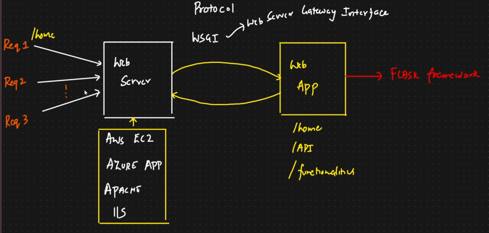
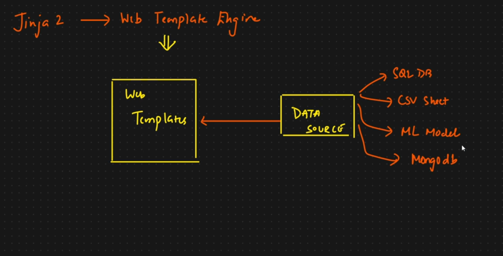
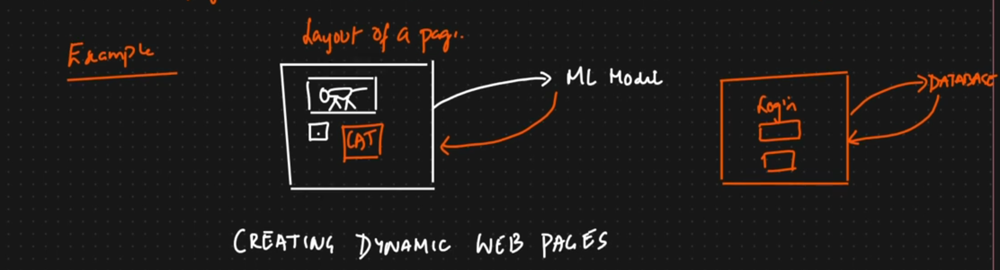

# Lecture 1: Flask Framework 

Flask is the fastest and best way to showcase how our ML model works. It is an End-to-End framework for web development. 

## Components of Flask -
1. WSGI - Web Server Gateway Interface
2. Jinja 2 Template Engine

Flask: Web serever created with the python programming Language.

2. Jinja 2 Template Engine -
    Combine a webtemplate (pages) with a data source(SQL DB, CSV sheet, ML Model, MongoDB). And the Web template is loaded.
    
    

    

# Lecture 2
